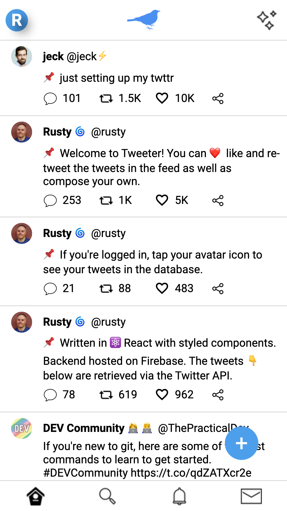

# Twitter 🦜 clone project

&nbsp;&nbsp;&nbsp;&nbsp;&nbsp;&nbsp;

Date completed: January 8, 2022  

**Optimized for 📱 mobile and 🖥 desktop!**  

**See it live at (https://tweeter-rusty-reebs.netlify.app)!**  

Objectives: replicate your favorite website as close as possible.  Shoot for lots of interesting functionality.  

### Screenshots
----

&nbsp;&nbsp;

### TIL Things I Learned
----

- how to use a serverless backend function on Netlify to fetch API data.
- used Postman to navigate Twitter's API.
- how to authenticate users with Firebase.
- used the `useEffect` hook for side effects like authentication and http requests.
- used the spread operator `[...]` to make a shallow copy and `JSON.stringify` and `JSON.parse` to make a deep copy of an array.
- in the future, I would give the Compose page its own route to allow for correct use of the browser back button.